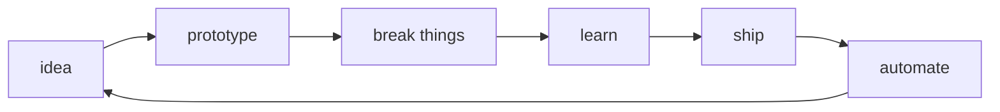

  

<h1 align="center">Hey, I am Marcos</h1>

  <b>Tech Lead / Senior Software Engineer</b> 
  Building AI systems, full-stack products, automations, and the occasional over-engineered personal workflow.

  

  
  
  

---

## About Me

I am a builder at heart. I started coding early, selling websites and small systems as a teenager, and over time that turned into a career across frontend, backend, mobile, DevOps, cloud, product engineering, and AI.

These days, I work mostly around production AI systems: agents, LLM orchestration, RAG, document intelligence, streaming experiences, tool calling, model fallback, observability, and the infrastructure needed to keep all of that running.

Outside work, I still like building software for myself: personal MVPs, home automation, local servers, self-hosted workflows, and small tools that make daily life a little smoother.

---

## What I Like Building

| Area | What usually catches my attention |
| --- | --- |
| AI products | Agents, RAG, LLM tools, document/spreadsheet intelligence, memory, streaming UX |
| Full-stack apps | React, Next.js, React Native, TypeScript, Node.js, Python, APIs, dashboards, product flows |
| Platform work | Cloud infra, CI/CD, observability, performance, reliability, cost optimization |
| Personal labs | Home automation, local servers, self-hosting, workflow automation, "what if?" experiments |

---

## Tech Playground

**AI and applied intelligence**

  
  
  
  
  
  
  
  
  
  
  

**Daily drivers**

  
  
  
  
  
  
  
  
  

**Frontend, mobile and product UI**

  
  
  
  
  
  
  

**Backend, APIs and data flows**

  
  
  
  
  
  
  
  

**Data, cloud and reliability**

  
  
  
  
  
  
  
  
  
  
  
  
  
  
  
  
  
  
  

**Also part of the journey**

  
  
  
  
  
  
  
  

---

## Current Experiments

- Making AI features feel less like demos and more like dependable product surfaces.
- Designing agent/tool flows that are explicit, observable, recoverable, and understandable by humans.
- Turning messy inputs such as PDFs, spreadsheets, chat history, and web data into useful context.
- Building personal automations for my house, routines, servers, and small daily annoyances.

---

## Public Work

- Published research on low-cost high-performance computing: [Proposta e Avaliacao de um Cluster de Banana Pi Single Boards com NAS Parallel Benchmarks](https://sol.sbc.org.br/index.php/sscad_estendido/article/view/30968), SSCAD 2024.
- Technical mentor in AI hackathon environments, helping teams shape ideas around LLMs, agents, RAG, and product execution.

---

## Build Loop

  
  
  
  
  
  

  

---

  I like software that ships, systems that survive production, and side projects that start with "this should probably be automated".

